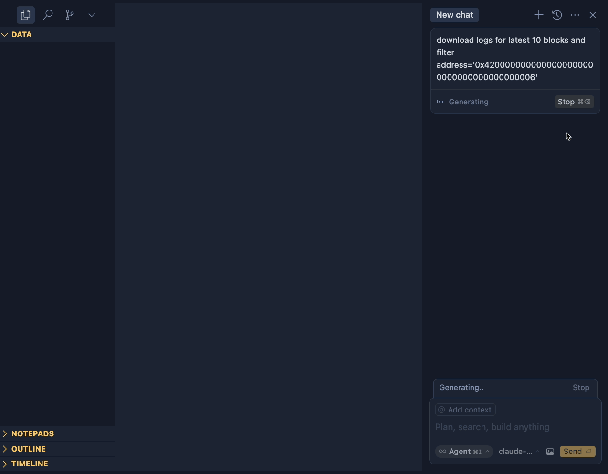

## Result



## Install

1. install uv

```
curl -LsSf https://astral.sh/uv/install.sh | sh
```

2. install cryo sql version

```
git clone --branch sql-query-option https://github.com/kbehouse/cryo/tree/sql-query-option

cd cryo && cargo build --release
```

### Cursor MCP setting

Cursor -> Settings... -> Cursor settings -> MCP

MAC: uv path /User/<user_name>/.local/bin/uv

```
{
  "mcpServers": {
   "cryo": {
      "command": "<uv-path>",
      "args": [
        "--directory",
        "<python-path>",
        "run",
        "<python-path>/server.py",
        "--rpc-url",
        "https://mainnet.base.org",
        "--data-dir",
        "<data-path>",
        "--cryo-path",
        "<cryo-rust-path>/target/release/cryo"
      ]
    }
  }
}
```

## Agent

cusor agent mode: cmd + L -> Agent

## prompt example

prompt ex1

```
download logs for latest 10 blocks and filter address='0x4200000000000000000000000000000000000006'
```

AI will

1. using tool fetching latest block
2. using tool download logs

- AI know how to generate correct SQL
- AI know fetching start block -> start block+10

prompt ex2

```
1. download blocks for latest 5 blocks
2. check shcema only keep number & hash
```

prompt ex3

```
1. download erc20_transfers for latest 100 blocks
2. check schema &  filter token 0x833589fCD6eDb6E08f4c7C32D4f71b54bdA02913, lower case it
3. the address is USDC filter USDC > 1000 * 10^6
```

## Acknowledgement

this project refer from cryo-mcp: https://github.com/z80dev/cryo-mcp/tree/main
